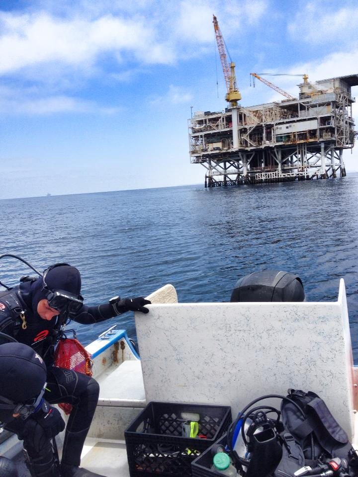
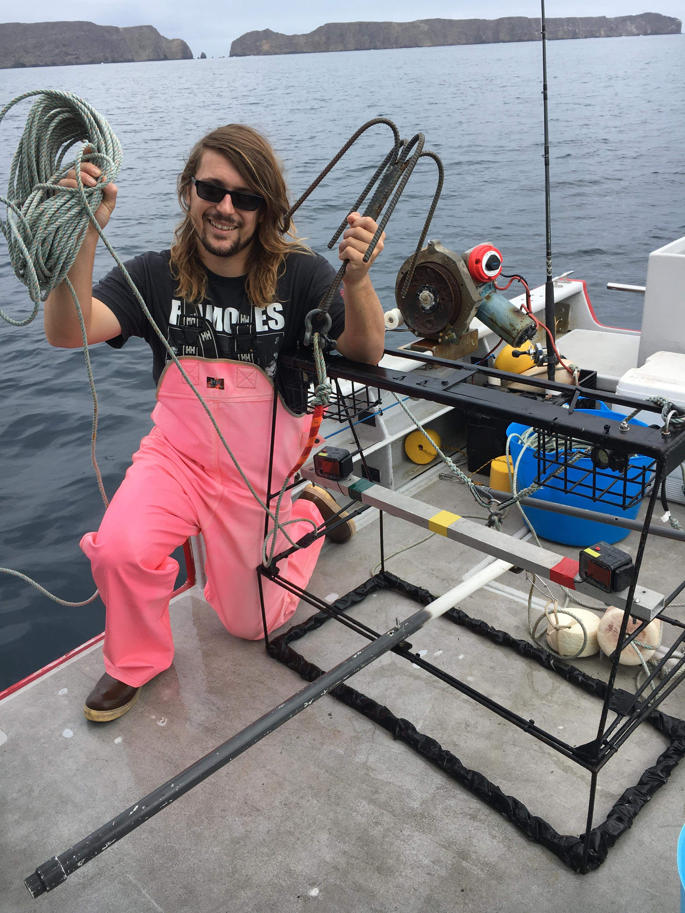

```{r setup, include=FALSE}
knitr::opts_chunk$set(echo = TRUE)
```

## I SCUBA 
### Because Fishes Are Easier to Talk to Than People

:::float-image

```{r out.width='220px', out.extra='style="float:left; padding:12px"', echo=FALSE}

```


For the last 8 years, I've spent much of my time SCUBA diving for various labs at UCSB. The first of those labs being the Love Lab (https://lovelab.msi.ucsb.edu/). The majority of our diving involved counting fish underneath and around oil platforms throughout California, under the cunning and omniscient guidance of Milton Love. All this diving brought along a menagerie of benefits: a wetsuit tan that cuts off at the neck and wrists (very chic), a wetsuit expertly shredded such that cold water enters and exists as it pleases, an appreciation for "being dry" for a whole day, and some of the greatest diving memories I'll ever have. Oh, and science too, we did some science while we were out there. 

:::

:::float-image

```{r out.width='250px', out.extra='style="float:right; padding:12px"', echo=FALSE}
knitr::include_graphics("pics/hard_high.png")
```

In recent years, I have moved over to another lab here at UCSB: the Caselle Lab (https://labs.eemb.ucsb.edu/caselle/jennifer/). Under our fearless leader, Jenn Caselle, we have SCUBA surveyed every island in the Santa Barbara Channel, dropped cameras to count fish far deeper than any of us could/would like to dive, and conducted hook and line fishing surveys in and out of Marine Protected Areas in the Channel. I've made amazing memories in this lab, made great friends, and who knows, maybe even grew from "SCUBA-Monkey" to "SCUBA-Neanderthal". Perhaps "SCUBA-Homosapien" could even be in my future. 

::: 

:::float-image

```{r out.width='220px', out.extra='style="float:left; padding:12px"', echo=FALSE}

```

Much like the Mafia, the only way out of the Love Lab is in a pine box, so even as I've moved on the other groups, I'm always on-call for another misadventure with the gang. The more time I spend in the Caselle Lab makes me realize that this is probably the case here as well. It turns out, a career in marine science is just joining a series of nerdy-gangs that you'll always be a part of. And I like it that way. 

:::


