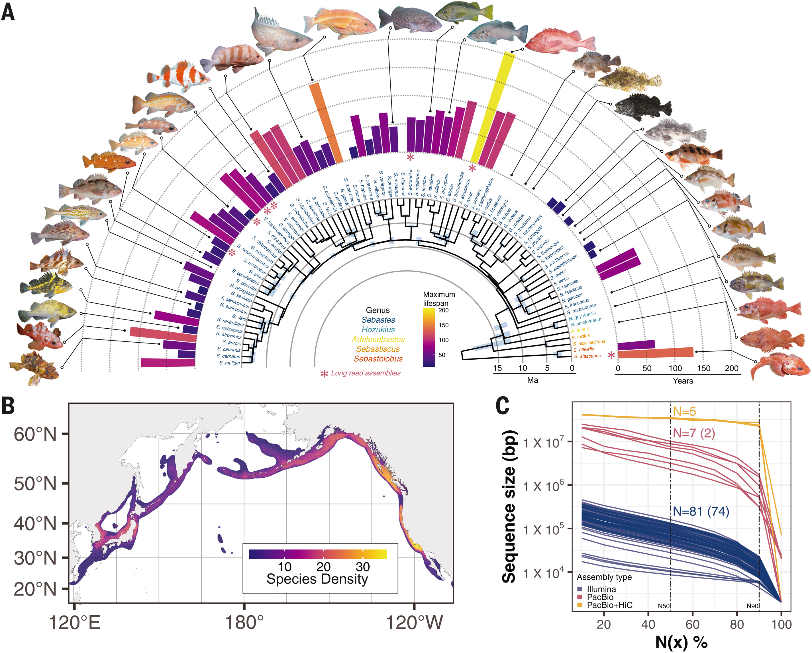
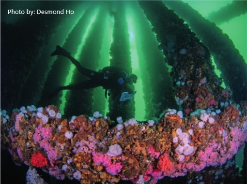
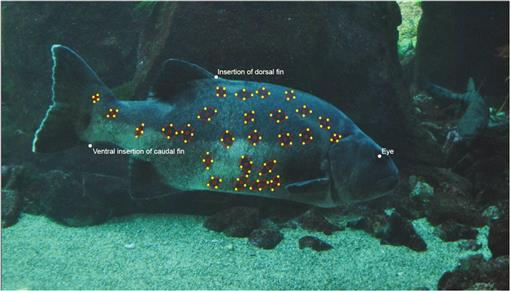

## Origins and Evolution of Extreme Life Span in Pacific Ocean Rockfishes

Kolora, Sree Rohit Raj, Gregory L. Owens, Juan Manuel Vazquez, Alexander Stubbs, Kamalakar Chatla, Conner Jainese, Katelin Seeto, et al. “Origins and Evolution of Extreme Life Span in Pacific Ocean Rockfishes.” Science 374, no. 6569 (November 12, 2021): 842–47. https://doi.org/10.1126/science.abg5332.

## The Role of Oil and Gas Conductors as Fish Habitat at Two Southern California Offshore Platforms

Love, Milton S., Scott Clark, Merit McCrea, Katelin Seeto, Conner Jainese, Mary Nishimoto, Ann Scarborough Bull, and Li Kui. “The Role of Oil and Gas Conductors as Fish Habitat at Two Southern California Offshore Platforms.” Bulletin, Southern California Academy of Sciences 119, no. 3 (February 2021): 68–77. https://doi.org/10.3160/0038-3872-119.3.68.

## Spots on Sides of Giant Sea Bass (Stereolepis Gigas Ayres, 1859) Are Likely Unique to Each Individual

Love, Milton S., Katelin Seeto, Conner Jainese, and Mary M. Nishimoto. “Spots on Sides of Giant Sea Bass (Stereolepis Gigas Ayres, 1859) Are Likely Unique to Each Individual.” Bulletin, Southern California Academy of Sciences 117, no. 1 (April 2018): 77–81. https://doi.org/10.3160/soca-117-01-77-81.1.
